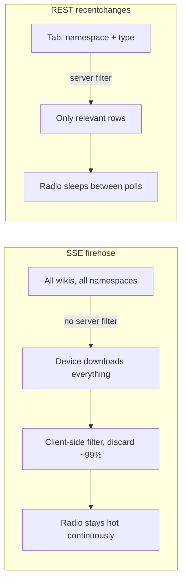
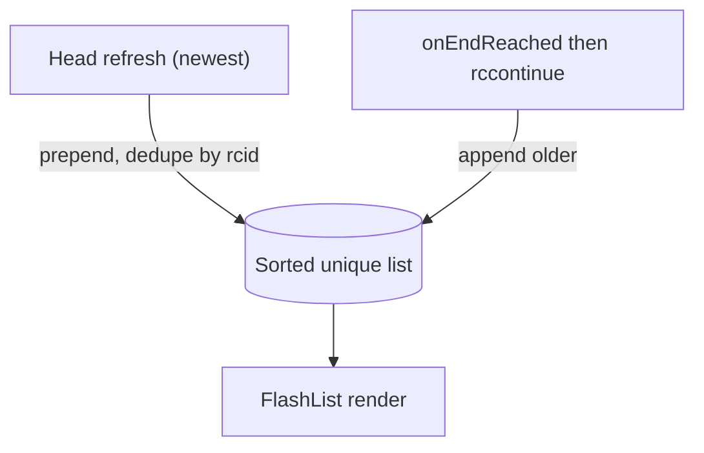
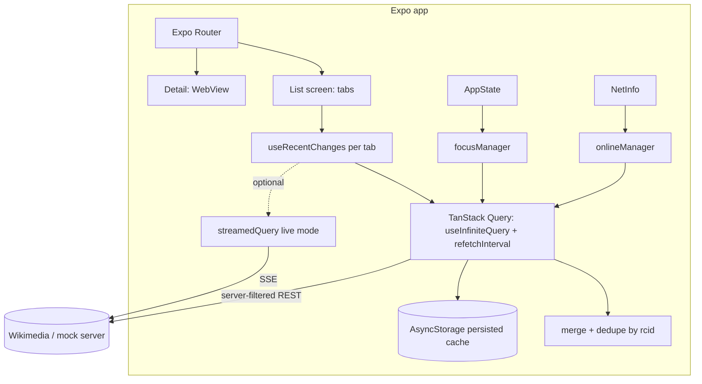

# NextMe Take-Home — Architecture & Approach Discussion (v1)

This document captures the technical discussion before writing any code. It answers the
questions raised, gives a recommendation per challenge evaluation point (#1–#7), and flags
the open decisions. Goal: strong judgment on a small surface, not everything half-finished.

---

## 0. TL;DR recommendation

- **Data source: poll the REST `recentchanges` API as the primary strategy; treat the SSE
  firehose as an optional, foreground-only "live mode."** This is the single most important
  decision and it pushes back on the initial streaming-first idea (reasoning below).
- **Keep TanStack Query.** It is the right tool. But for the list, lean on
  `useInfiniteQuery` + `refetchInterval`, not `experimental_streamedQuery`. Reserve
  `streamedQuery` for the optional live mode only.
- **Use `focusManager` (AppState) + `onlineManager` (NetInfo).** Your instinct was right but
  the role of each was swapped — details below.
- **Persist the cache** with `@tanstack/react-query-persist-client` + AsyncStorage for
  offline/last-known-good.
- **FlashList yes**, but understand it solves *rendering* performance, not pagination.
- **Mock server: Express + TypeScript (or Hono).** Nest is overkill for a 3–4h challenge.
- **Env vars: Expo's built-in `EXPO_PUBLIC_*` + `app.config.ts` `extra`.** No extra lib.

---

## 1. The central decision: SSE firehose vs REST polling

This is the crux of the whole challenge, so it goes first.

### What the two endpoints actually are

- **SSE stream** (`https://stream.wikimedia.org/v2/stream/recentchange`): a single global
  firehose of **every change to every Wikimedia wiki**. Confirmed from Wikimedia docs:
  - **No server-side filtering.** You cannot ask for "namespace 0 on enwiki only" — you
    receive *everything* and filter on the client.
  - Volume is **>1M events/day globally** (~150k/day for English Wikipedia alone), i.e.
    tens to hundreds of events/second.
  - You must also discard "canary" events (`meta.domain === 'canary'`).
  - Resumable via `Last-Event-ID` / `since`.
- **REST `recentchanges`** (`action=query&list=recentchanges`): supports **server-side
  filtering** (`rcnamespace`, `rctype`, `rcshow`), **pagination** (`rccontinue`), result
  limits (`rclimit`), and field selection (`rcprop`). You get back exactly the tab you want.

### Why this matters for a mobile, battery-aware app

The challenge explicitly evaluates "keep the list fresh without hammering the network or
draining the battery." An always-open SSE socket that downloads the entire global firehose
and throws away ~99% of it on-device is the **worst** option for both radio-on time and CPU.
On cellular, keeping the radio in a high-power state continuously is a primary battery cost.

Polling, by contrast, lets the radio sleep between requests, transfers only the rows for the
selected tab (server-filtered), and maps cleanly onto pagination.

### Recommendation

- **Default = polling.** `useInfiniteQuery` for pagination + a periodic refresh of the head
  (newest page) via `refetchInterval` (e.g. 10–20s while focused). This gives freshness with
  predictable, throttle-able network usage.
- **Optional "Live" toggle = SSE.** If we want to show off real-time and `streamedQuery`,
  expose a per-screen toggle that opens the stream **only while the app is foregrounded and
  the user opted in**, filtering client-side to the active tab. Off by default to protect
  battery. This is a great "with more time" item and a strong talking point in the follow-up.

This reframes your `streamedQuery` plan: it's a nice secondary mode, not the backbone.

---

## 2. Library choice: TanStack Query vs alternatives vs "by hand"

### Keep TanStack Query — yes

It directly buys us almost every evaluation criterion:
- loading / error / empty / `isFetching` vs `isLoading` (smooth refresh vs blanking) → #3
- `useInfiniteQuery` for pagination → #4
- `staleTime` / `refetchInterval` / dedup of overlapping requests → #1, #4
- `focusManager` / `onlineManager` for background/foreground/offline → #2, #5
- cache persistence for offline → #5
- devtools for cache inspection → tooling

### Alternatives (and why not, for this scope)

- **By hand (`useEffect` + `fetch` + reducers):** Possible, but you'd re-implement request
  dedup, cache keys, stale-while-revalidate, retry/backoff, focus/online refetch, and
  persistence. That's exactly the surface area the challenge is testing, so hand-rolling it
  is high-risk in 3–4h and easy to get subtly wrong (race conditions, ordering). Not worth it.
- **SWR:** Lighter, great for simple fetching, but its infinite/pagination story
  (`useSWRInfinite`) and offline persistence are less batteries-included than TanStack for
  this case. Reasonable, but TanStack is the stronger fit here.
- **RTK Query:** Excellent if we were already on Redux Toolkit. Pulling in Redux just for
  this is heavier than needed.
- **Apollo / urql:** GraphQL-oriented; Wikimedia is REST/SSE. Not applicable.
- **Legend-State / Zustand + custom fetching:** Good state libs, but they're not data-fetching
  layers; we'd still hand-roll the network concerns above.

**Verdict:** TanStack Query is the correct, defensible choice. State-management beyond it is
minimal (a little local UI state); no global store needed → avoids over-engineering (#6).

### On `experimental_streamedQuery` specifically

Confirmed behavior (TanStack docs):
- Wraps an `AsyncIterable`; data accumulates (default: append to array; custom `reducer`
  supported). Query is `pending` until the first chunk, `success` after, and stays
  `fetchStatus: 'fetching'` until the stream ends.
- `refetchMode: 'reset' | 'append' | 'replace'`.

Pros: elegant for consuming SSE; integrates streaming into the same cache/loading model.
Cons / risks for this challenge:
- **Experimental** — API may change (they added `reducer`, removed `maxChunks` recently).
- A never-ending stream means the query is **permanently `fetching`** — you must design UI
  state around that, and manage memory growth (cap retained rows yourself now that
  `maxChunks` is gone — use a custom `reducer`).
- It pairs awkwardly with **`useInfiniteQuery`** (downward pagination), so you end up with two
  models to reconcile.

→ Use it for the optional live mode, keep it out of the core list path.

---

## 3. Point-by-point against the evaluation criteria

### #1 Freshness without hammering network/battery
- Polling with `refetchInterval` only while focused (`refetchIntervalInBackground: false`).
- `staleTime` tuned so tab switches reuse cache instead of refetching instantly.
- Server-side filtering keeps payloads tiny.
- Descriptive `User-Agent` header per Wikimedia guidelines.
- Throttle/Backoff on errors (TanStack retry with exponential backoff).

**Measuring battery (your question):** No, TanStack does **not** report battery usage, and I
found no official battery benchmark from them — battery cost is a property of *how you use the
network/CPU*, not the library. Practical ways to measure/argue it:
- **Proxy metrics (cheap, in-app):** count requests/min, bytes transferred, and number of
  re-renders. Fewer requests + smaller payloads + fewer renders ≈ less battery. Easy to log.
- **Device tools:** Xcode **Instruments → Energy Log / Network**, Android Studio **Energy
  Profiler** / **Battery Historian**.
- **`expo-battery`** can read battery level/state at runtime for a rough before/after, but
  it's not a profiler.
- For the writeup, the honest framing is: "I minimized radio-on time and payload size, here
  are the proxy metrics; rigorous energy profiling would be the next step."

### #2 Background / foreground / tab switches
Your idea was right but the API roles were swapped:
- **`focusManager`** = app focus (foreground/background). Wire it to RN **`AppState`**. This
  is what pauses/resumes refetch on background/foreground.
- **`onlineManager`** = connectivity (online/offline). Wire it to **`@react-native-community/netinfo`**.
  This is what pauses refetch when there's no network and resumes on reconnect.

So: on background → `focusManager` reports unfocused → polling pauses and any SSE socket
closes. On foreground → refetch the head once, resume interval. Tab switches → each tab is a
separate query key; switching reuses cached data (no blank) and refetches if stale.

### #3 Smooth refresh (no flicker/blank)
- Distinguish `isLoading` (first load → skeleton) from `isFetching` (background refresh →
  subtle indicator, keep showing old data). TanStack keeps `data` during refetch by default.
- `placeholderData: keepPreviousData` when switching tabs/pages so the list doesn't blank.
- Stable `keyExtractor` (by `rcid`) so FlashList doesn't remount rows.

### #4 Correctness while data shifts (the hard part)
This is where the "shifting list" trap lives. Key idea: **never paginate by offset.**
- Recent changes grow at the **head**; pagination goes toward **older** entries, which are
  stable. Use cursor pagination via **`rccontinue`** (or `rcid`/timestamp), not page numbers.
- New items **prepend** at the top on refresh; merge them deduped by **`rcid`**.
- Maintain a single sorted, de-duplicated list (sort by timestamp/`rcid`). This handles
  overlapping requests and out-of-order responses: late responses are merged idempotently by
  id rather than appended blindly.

**Does TanStack handle this for us?** Partially. `useInfiniteQuery` manages pages, cursors,
and dedup of *in-flight* requests. It does **not** automatically merge a live head into a
paginated list or dedupe by domain id — that merge/sort/dedupe logic is ours to write (small,
testable pure function). That function is a good unit-test target and a strong portfolio note.

### #5 Failure & offline
- TanStack retry/backoff for transient failures; surface a non-blocking error toast/banner
  with retry.
- **Offline cache:** TanStack has **first-class persistence** — `persistQueryClient` /
  `PersistQueryClientProvider` from `@tanstack/react-query-persist-client` with an
  **AsyncStorage** persister. We control: which queries persist (dehydrate filter),
  `maxAge`, and `gcTime`. On cold start offline, the persisted cache hydrates and we show
  last-known-good data.
- **Offline UX (your idea, kept):** banner "Offline — showing data from {relative time}",
  derived from the query's `dataUpdatedAt`. Disable/queue refetch until `onlineManager`
  reports online.

**Inspecting the cache (your question):** Yes —
- **TanStack Query DevTools**; in RN/Expo use **`@dev-plugins/react-query`** (Expo dev-tools
  plugin) or the React Native DevTools / Flipper integration to view cache keys, states,
  and data live.
- Programmatically: `queryClient.getQueryCache().getAll()` for a quick debug screen.

### #6 Code quality / no over-engineering
- Two screens, file-based routing (Expo Router). No Redux, no global store beyond TanStack.
- Thin API layer (typed fetchers + zod-validated responses optional), a `useRecentChanges`
  hook per tab, the merge/dedupe util, and presentational components.
- Keep the SSE/live mode behind a flag so the core stays simple.

### #7 Navigation polish (explicitly not a focus)
- **Expo Router** (file-based, built on React Navigation). A stack with the list (tabs) →
  detail (WebView). Tabs can be in-screen segmented control rather than a bottom tab nav to
  keep it light. Don't gold-plate transitions.

---

## 4. Detail screen (WebView)
- `react-native-webview`, open the page's canonical URL (build from `title`/`serverurl` in
  the change payload).
- Own loading state (`onLoadStart`/`onLoadEnd` → spinner) and error state
  (`onError`/`onHttpError` → retry). Hardware/gesture back handled by the stack navigator.

---

## 5. FlashList vs alternatives
- **FlashList (Shopify):** solves **rendering** performance for long, recycling lists
  (lower memory, fewer dropped frames) — valuable here because the list is long and updates
  often. It does **not** give pagination by itself; you still wire `onEndReached` +
  `useInfiniteQuery`. The win is it re-renders smoothly during frequent updates (#3).
- **Alternatives:** `FlatList` (fine, default, slightly less efficient on heavy churn),
  `@legendapp/list` (Legend List, newer competitor). FlashList is the safe, well-known pick.
- Note: FlashList v2 dropped some manual sizing props (auto-sizing); just be on a current
  version.

---

## 6. Mock server for edge cases
Strong idea and a real differentiator for demonstrating #1–#5.

- **Stack: Express + TypeScript** (or **Hono** if you want lighter + great TS DX). **Nest is
  overkill** for a few endpoints in a 3–4h budget; its module/DI ceremony costs more than it
  returns here. You still get strong typing with plain TS + zod.
- **Endpoints to mimic:**
  - REST: `GET /w/api.php?action=query&list=recentchanges...` returning the same JSON shape
    (incl. `continue.rccontinue`) so the app can't tell mock from real.
  - SSE: `GET /v2/stream/recentchange` emitting `recentchange` events.
- **Control panel at `/mock`:** buttons to trigger scenarios:
  - "1 page/sec" steady stream, "burst" (N events at once), "slow network" (artificial
    latency), "500 error", "drop connection", "offline", "out-of-order / duplicate ids"
    (to prove the dedupe/merge logic), "empty result".
- App points at the mock via env var (below). This lets you *demonstrate* offline/error/
  ordering correctness deterministically instead of waiting for the real firehose.

Scope note: build the mock only if core app is on track — it's high-value but cuttable.

---

## 7. Env vars in Expo
You're right that Expo has this built in; no extra library needed:
- **`EXPO_PUBLIC_*`** variables from a `.env` file are inlined at build time and readable via
  `process.env.EXPO_PUBLIC_API_BASE_URL`. Good for the API base URL (real vs mock).
- For structured/computed config, **`app.config.ts`** `extra` + **`expo-constants`**
  (`Constants.expoConfig.extra`).
- Caveat: `EXPO_PUBLIC_*` values are **embedded in the bundle** — never put secrets there.
  Fine here since Wikimedia read access needs no key.

---

## 8. Proposed architecture (overview)

---

## 9. What I'd cut to stay in budget (scope honesty for the README)
Priority order (build top-down, stop when time's up):
1. List screen: one tab working end-to-end (REST polling + infinite scroll + states).
2. Remaining tabs + freshness indicator + smooth-refresh polish.
3. Detail WebView with its own states.
4. Offline persistence + offline banner.
5. Merge/dedupe correctness util + a unit test or two.
6. Mock server with scenario buttons.
7. SSE "live mode" toggle (`streamedQuery`).

Items 6–7 are the first to cut; the README will state this explicitly.

---

## 10. Open decisions to confirm
1. **Primary data strategy:** agree to **REST polling as default, SSE as optional live mode**?
   (vs streaming-first.)
2. **Tabs:** proposed set — **All**, **Articles (ns 0)**, **New pages** (`rctype=new`).
   Add **Edits**? 3–4 tabs max.
3. **Mock server in scope** for v1, or note as stretch?
4. **Repo layout:** monorepo (`/app`, `/mock-server`) vs two folders. Recommend a simple
   workspace with both.

## 11. Anything missing / nice-to-haves (not over-engineering)
- Pull-to-refresh on the list (cheap, expected UX).
- Relative-time "last updated" via `dataUpdatedAt` (ties freshness + offline messaging).
- Zod validation of API responses (catches shape drift, small cost).
- A tiny debug screen listing cache keys (great for the walkthrough; optional).
- AI_USAGE.md + README required deliverables — plan time for them.
