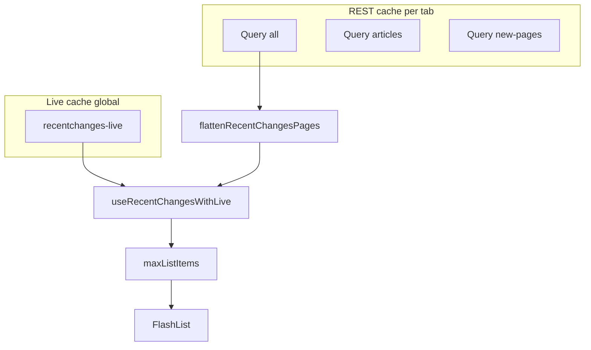

# WikiNow — Cache Behavior

How TanStack Query caches recent-changes data in the mobile app. Read this alongside [architecture.md](./architecture.md) (data strategy) and [plan.md](./plan.md) (implementation status).

**Last updated:** 2026-06-26

---

## Short answer

The cache is **per query (per tab + filter + pageSize)**, not per individual wiki change.

- Each tab has its **own REST cache entry**.
- Inside that entry, data is stored as **pages** — one page per **API request** (`pageSize` items each, configurable).
- The UI flattens pages, merges live stream events when enabled, dedupes by `rcid`, and caps display length.
- There is **no per-item cache** keyed by `rcid`.

---

## REST cache keys

Defined in [`hooks/useRecentChanges.ts`](../mobile-app/hooks/useRecentChanges.ts):

```typescript
queryKey: ['recentchanges', tab, filter, config.pageSize]
```

| Tab | Query key (conceptually) | API filters |
|-----|--------------------------|-------------|
| All | `['recentchanges', 'all', {}, pageSize]` | none |
| Articles | `['recentchanges', 'articles', { rcnamespace: 0 }, pageSize]` | namespace 0 |
| New pages | `['recentchanges', 'new-pages', { rctype: 'new' }, pageSize]` | type new |

Changing `pageSize` in Config creates a **new query key** (cache does not carry over).

Switching tabs reads from a **different cache entry**. The same `rcid` **can appear in multiple tab caches** if it matches each tab’s filters.

---

## Live stream cache key

Separate from REST, in [`providers/LiveModeProvider.tsx`](../mobile-app/providers/LiveModeProvider.tsx):

```typescript
queryKey: ['recentchanges-live']
```

- **Global** (not per tab) — one SSE connection for the app
- **Not persisted** to AsyncStorage (`dehydrateOptions` excludes this key; `gcTime: 0`)
- Buffer capped in `streamedQuery` reducer by `streamBufferMax` (config)
- Merged into the displayed list in [`hooks/useRecentChangesWithLive.ts`](../mobile-app/hooks/useRecentChangesWithLive.ts), then capped by `maxListItems`

---

## What is stored inside one REST cache entry

`useInfiniteQuery` stores a **paginated result**:

```typescript
{
  pages: [
    { changes: RecentChange[], nextCursor?: string },
    { changes: RecentChange[], nextCursor?: string },
  ],
  pageParams: [undefined, "timestamp|rcid", ...]
}
```

| Action | Cache effect |
|--------|--------------|
| First load | 1 page cached |
| `fetchNextPage` | Appends another page to **same** query |
| Pull to refresh / poll | Refetches page(s); updates `pages` |
| Tab switch | Different query key |
| Live mode on | REST polling paused; stream prepends at display layer |

Flattening: [`lib/recent-changes/flatten-pages.ts`](../mobile-app/lib/recent-changes/flatten-pages.ts) → `flattenRecentChangesPages()` via [`lib/recent-changes/merge-changes.ts`](../mobile-app/lib/recent-changes/merge-changes.ts).

---

## Flow diagram



---

## Timing: when is cache used vs refetched?

### Global defaults — [`lib/query/query-client.ts`](../mobile-app/lib/query/query-client.ts)

| Option | Value | Meaning |
|--------|-------|---------|
| `staleTime` | 90s | Data is “fresh” for 90s |
| `gcTime` | 24h | Unused query data kept up to 24 hours |
| `retry` | 2 | Retry failed requests twice |
| `refetchOnWindowFocus` | `true` | Refetch on foreground |
| `refetchOnReconnect` | `true` | Refetch on reconnect |

### Per-query polling — [`hooks/useRecentChanges.ts`](../mobile-app/hooks/useRecentChanges.ts)

| Option | Source | Meaning |
|--------|--------|---------|
| `refetchInterval` | `config.refetchIntervalMs` (default 90s) | Poll while online and live **off** |
| `refetchInterval` | `false` when live on | Stream delivers head updates |
| `refetchIntervalInBackground` | `false` | No background polling |

Relative-time labels refresh on `config.tickMs` (default 10s) via [`hooks/useRelativeTime.ts`](../mobile-app/hooks/useRelativeTime.ts).

Foreground/background: [`lib/query/setup-query-managers.ts`](../mobile-app/lib/query/setup-query-managers.ts) (`focusManager` + initial `AppState`, `onlineManager` + NetInfo).

---

## Persistence (AsyncStorage)

Configured in [`providers/QueryProvider.tsx`](../mobile-app/providers/QueryProvider.tsx):

- **Persister:** [`lib/query/async-storage-persister.ts`](../mobile-app/lib/query/async-storage-persister.ts)
- **Storage key:** `wikinow-query-cache`
- **maxAge:** 24 hours
- **Excluded:** `['recentchanges-live']` (live stream buffer)

On restart, REST query caches rehydrate as **query keys → pages**. Offline banner reads last-known-good from persisted REST data.

**App config** (polling, page size, theme, etc.) is stored separately under `wikinow-app-config` via [`providers/AppConfigProvider.tsx`](../mobile-app/providers/AppConfigProvider.tsx).

---

## What “X changes loaded” means

From [`components/ChangesListHeader.tsx`](../mobile-app/components/ChangesListHeader.tsx):

> **X changes loaded** = unique items shown in the FlashList **after** REST flatten + live merge + `maxListItems` cap.

It is **not** total Wikipedia changes or a permanent local database.

---

## Refetch behavior on infinite queries

Refetch (poll, pull-to-refresh, focus, reconnect) re-executes the infinite query — typically **all loaded pages**, not just page 1.

- Scrolled to 3 pages → refetch may hit the API 3 times.
- Head of the feed shifts; [`mergeChanges`](../mobile-app/lib/recent-changes/merge-changes.ts) dedupes by `rcid` (incoming wins).

---

## Freshness metadata

[`types/feed-freshness.ts`](../mobile-app/types/feed-freshness.ts):

```typescript
freshness: {
  lastUpdatedAt: number | null;
  source: 'api' | 'stream' | 'cache';
}
```

- **API:** REST refetch success (`dataUpdatedAt`)
- **Stream:** live mode on — `mergeFeedFreshness()` with stream query `dataUpdatedAt`
- **Cache:** offline with cached rows

---

## What we cache

| Data | Cached? | Notes |
|------|---------|-------|
| Recent changes list (per tab) | Yes | `useInfiniteQuery` pages |
| Live stream buffer | Yes (memory only) | `recentchanges-live`, capped, not persisted |
| Individual `rcid` globally | No | |
| WebView page content | No | |
| App config | Yes | AsyncStorage `wikinow-app-config` |

---

## Inspecting the cache (development)

- **Expo dev plugin:** `@dev-plugins/react-query` in `QueryProvider`
- **Live logs:** enable `liveLogEnabled` in Config tab

Look for `['recentchanges', ...]` and `['recentchanges-live']`.

---

## Related files

| File | Role |
|------|------|
| [`hooks/useRecentChanges.ts`](../mobile-app/hooks/useRecentChanges.ts) | REST query key, polling |
| [`hooks/useRecentChangesWithLive.ts`](../mobile-app/hooks/useRecentChangesWithLive.ts) | Merge + list cap + freshness |
| [`providers/LiveModeProvider.tsx`](../mobile-app/providers/LiveModeProvider.tsx) | Live stream query |
| [`api/recent-changes.ts`](../mobile-app/api/recent-changes.ts) | REST fetcher + pagination |
| [`lib/recent-changes/map-wiki-change.ts`](../mobile-app/lib/recent-changes/map-wiki-change.ts) | Wiki API → `RecentChange` mapping |
| [`types/wiki-recent-change.ts`](../mobile-app/types/wiki-recent-change.ts) | Wiki API response types |
| [`constants/app-config.ts`](../mobile-app/constants/app-config.ts) | `pageSize`, `refetchIntervalMs`, caps |
| [`lib/query/query-client.ts`](../mobile-app/lib/query/query-client.ts) | Global stale/gc defaults |
| [`providers/QueryProvider.tsx`](../mobile-app/providers/QueryProvider.tsx) | Persistence + dehydrate filter |
| [`lib/recent-changes/flatten-pages.ts`](../mobile-app/lib/recent-changes/flatten-pages.ts) | Page flatten |
| [`lib/recent-changes/merge-changes.ts`](../mobile-app/lib/recent-changes/merge-changes.ts) | Dedupe/sort for merge paths |
| [`lib/recent-changes/matches-tab-filter.ts`](../mobile-app/lib/recent-changes/matches-tab-filter.ts) | Tab filter on live merge |

---

## Future changes

| Feature | Impact |
|---------|--------|
| Mock server | Same cache model; point `EXPO_PUBLIC_*` URLs at mock |
