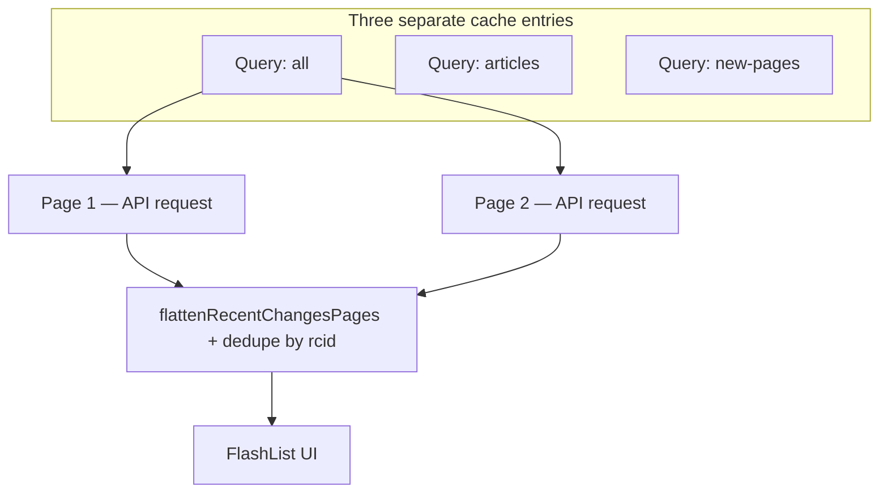

# WikiNow — Cache Behavior

How TanStack Query caches recent-changes data in the mobile app. Read this alongside [architecture.md](./architecture.md) (data strategy) and [plan.md](./plan.md) (implementation status).

**Last updated:** 2026-06-26

---

## Short answer

The cache is **per query (per tab + filter)**, not per individual wiki change.

- Each tab has its **own cache entry**.
- Inside that entry, data is stored as **pages** — one page per **API request** (50 items each).
- The UI flattens all loaded pages and dedupes by `rcid` before rendering.
- There is **no per-item cache** keyed by `rcid`.

---

## Cache keys (one entry per tab)

Defined in [`hooks/useRecentChanges.ts`](../mobile-app/hooks/useRecentChanges.ts):

```typescript
queryKey: ['recentchanges', tab, filter]
```

| Tab | Query key | API filters |
|-----|-----------|-------------|
| All | `['recentchanges', 'all', {}]` | none |
| Articles | `['recentchanges', 'articles', { rcnamespace: 0 }]` | namespace 0 |
| New pages | `['recentchanges', 'new-pages', { rctype: 'new' }]` | type new |

Switching tabs reads from a **different cache entry**. If a tab was loaded before, TanStack can show cached data immediately while refetching in the background.

The same wiki change (`rcid`) **can appear in multiple tab caches** if it matches each tab’s filters.

---

## What is stored inside one cache entry

`useInfiniteQuery` stores a **paginated result**, not a flat list:

```typescript
{
  pages: [
    { changes: RecentChange[], nextCursor?: string },  // 1st API call (newest)
    { changes: RecentChange[], nextCursor?: string },  // 2nd API call (older)
    // ...
  ],
  pageParams: [undefined, "timestamp|rcid", ...]
}
```

| Action | Cache effect |
|--------|--------------|
| First load | 1 page cached (~50 items) |
| Scroll / `fetchNextPage` | Appends another page to **same** query |
| Pull to refresh / poll | Refetches page(s); TanStack updates the cached `pages` array |
| Tab switch | Reads a **different** query key |

Mapping from API → page happens in [`api/recent-changes.ts`](../mobile-app/api/recent-changes.ts). Flattening pages → list happens in [`lib/recent-changes.ts`](../mobile-app/lib/recent-changes.ts) via `flattenRecentChangesPages()` (dedupe by `rcid`).

---

## Flow diagram



---

## Timing: when is cache used vs refetched?

### Global defaults — [`lib/query-client.ts`](../mobile-app/lib/query-client.ts)

| Option | Value | Meaning |
|--------|-------|---------|
| `staleTime` | 90s | Data is “fresh” for 90s; may skip refetch on remount |
| `gcTime` | 24h | Unused query data kept in memory up to 24 hours |
| `retry` | 2 | Retry failed requests twice |
| `refetchOnWindowFocus` | `true` | Refetch when app returns to foreground |
| `refetchOnReconnect` | `true` | Refetch when network comes back |

### Per-query polling — [`hooks/useRecentChanges.ts`](../mobile-app/hooks/useRecentChanges.ts)

| Option | Value | Meaning |
|--------|-------|---------|
| `refetchInterval` | 90s (`REFETCH_INTERVAL_MS`) | Poll while query is active |
| `refetchIntervalInBackground` | `false` | No polling when app is backgrounded |

Foreground/background and connectivity are wired via `focusManager` and `onlineManager` in [`lib/setup-query-managers.ts`](../mobile-app/lib/setup-query-managers.ts).

---

## Persistence (AsyncStorage)

Configured in [`providers/QueryProvider.tsx`](../mobile-app/providers/QueryProvider.tsx):

- **Persister:** [`lib/async-storage-persister.ts`](../mobile-app/lib/async-storage-persister.ts)
- **Storage key:** `wikinow-query-cache`
- **maxAge:** 24 hours

On app restart, the **entire QueryClient cache** is rehydrated from AsyncStorage — still organized as **query keys → pages**, not individual items.

This enables offline **last-known-good** data once the offline banner is implemented. Until then, persistence runs silently in the background.

---

## What “X changes loaded” means

From [`components/ChangesListHeader.tsx`](../mobile-app/components/ChangesListHeader.tsx):

> **X changes loaded** = number of unique items (`rcid`) across all **pages currently cached** for this tab.

It is **not**:

- Total changes on Wikipedia
- A cumulative local database that grows day by day
- All changes from “today + tomorrow” stored forever

It **is**:

- “How many rows we’re showing right now from fetched API pages”

---

## Refetch behavior on infinite queries

When a refetch runs (poll, pull-to-refresh, focus, reconnect), TanStack re-executes the query. For `useInfiniteQuery`, that typically means **re-fetching all pages already loaded**, not just the first page.

Implications:

- If the user scrolled to 3 pages (~150 items), a refetch may hit the API 3 times.
- The recent-changes feed **shifts** underneath you; refetched page 1 may contain new edits at the head.
- Full correctness when merging head refresh into paginated tail is the job of [`mergeChanges`](../mobile-app/lib/merge-changes.ts) (incoming wins on duplicate `rcid`, sorted by `rcid` desc). `flattenRecentChangesPages` chains `mergeChanges` across pages.

---

## Freshness metadata

[`types/feed-freshness.ts`](../mobile-app/types/feed-freshness.ts) tracks when data last changed:

```typescript
freshness: {
  lastUpdatedAt: number | null;  // from query.dataUpdatedAt
  source: 'api';                 // 'stream' | 'cache' later
}
```

- **Today:** updated when an API refetch succeeds.
- **Future (live mode):** stream events will merge via `mergeFeedFreshness()` — cache structure stays the same; only the freshness timestamp source expands.

---

## What we do NOT cache

| Data | Cached? |
|------|---------|
| Recent changes list (per tab) | Yes — query + pages |
| Individual `rcid` globally | No |
| WebView page content | No |
| Stream / SSE connection state | Not yet (live mode pending) |

---

## Inspecting the cache (development)

- **Expo dev plugin:** `@dev-plugins/react-query` (wired in `QueryProvider`)
- **Programmatically:** `queryClient.getQueryCache().getAll()` in a debug screen

Look for keys starting with `['recentchanges', ...]`.

---

## Related files

| File | Role |
|------|------|
| [`hooks/useRecentChanges.ts`](../mobile-app/hooks/useRecentChanges.ts) | Query key, polling, exposes `changes` + `freshness` |
| [`lib/query-client.ts`](../mobile-app/lib/query-client.ts) | Global stale/gc/focus/reconnect defaults |
| [`providers/QueryProvider.tsx`](../mobile-app/providers/QueryProvider.tsx) | Persistence + devtools |
| [`lib/async-storage-persister.ts`](../mobile-app/lib/async-storage-persister.ts) | AsyncStorage adapter |
| [`lib/recent-changes.ts`](../mobile-app/lib/recent-changes.ts) | Page flatten + dedupe |
| [`lib/setup-query-managers.ts`](../mobile-app/lib/setup-query-managers.ts) | Focus + online managers |

---

## Future changes

| Feature | Impact on cache |
|---------|-----------------|
| `mergeChanges` util | Smarter merge on refetch; used by `flattenRecentChangesPages` |
| Offline banner | Reads `onlineManager` + persisted cache + `freshness` |
| SSE live mode | Stream prepends to list; `mergeFeedFreshness` for timestamps |
| Mock server | Same cache model; `EXPO_PUBLIC_API_BASE_URL` points to mock |
