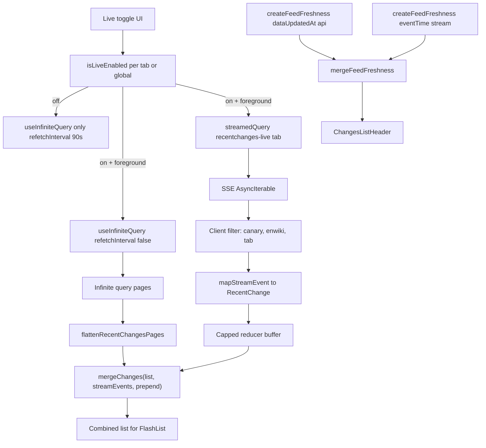

# WikiNow — SSE Live Mode Implementation Guide

Handoff doc for implementing the optional **Live mode** toggle. Read with [architecture.md](./architecture.md) (strategy) and [cache-behavior.md](./cache-behavior.md) (REST cache model).

**Status:** Implemented. REST polling by default; global Live toggle in tab header via `streamedQuery`.

**Last updated:** 2026-06-26

---

## Goal

Mirror Wikimedia's own [Recent Changes "Live updates" button](https://www.mediawiki.org/wiki/Special:RecentChanges): **REST polling by default**, user-opt-in **SSE stream** for real-time head updates while foregrounded.

---

## What already exists (do not redo)

| Piece | Location | Notes |
|-------|----------|-------|
| REST polling + pagination | [`hooks/useRecentChanges.ts`](../mobile-app/hooks/useRecentChanges.ts) | `useInfiniteQuery`, 90s poll, `keepPreviousData` |
| Tab filters | [`constants/tabs.ts`](../mobile-app/constants/tabs.ts) | All / Articles (`rcnamespace=0`) / New pages (`rctype=new`) |
| List merge util | [`lib/merge-changes.ts`](../mobile-app/lib/merge-changes.ts) | Dedupe by `rcid`, incoming wins, sort desc |
| Freshness types | [`types/feed-freshness.ts`](../mobile-app/types/feed-freshness.ts) | `mergeFeedFreshness()`, sources: `api` \| `stream` \| `cache` |
| Freshness UI | [`components/ChangesListHeader.tsx`](../mobile-app/components/ChangesListHeader.tsx) | Already renders `Live · updated Xm ago` when `source === 'stream'` |
| Stream env URL | [`constants/env.ts`](../mobile-app/constants/env.ts) | `env.streamBaseUrl` → `EXPO_PUBLIC_STREAM_BASE_URL` |
| Lifecycle | [`lib/setup-query-managers.ts`](../mobile-app/lib/setup-query-managers.ts) | `focusManager` + `onlineManager` wired |
| Offline banner | [`components/OfflineBanner.tsx`](../mobile-app/components/OfflineBanner.tsx) | Uses `source: 'cache'` when offline |

Comment in `useRecentChanges.ts` line 35 explicitly awaits stream merge:
```typescript
// merge with stream timestamps via mergeFeedFreshness when live mode lands.
```

---

## Critical constraints (from architecture discussion)

1. **SSE is a global firehose** — no server-side filtering.
   - URL: `{streamBaseUrl}/v2/stream/recentchange`
   - >1M events/day globally; filter **on device**
2. **Discard canary events:** `meta.domain === 'canary'`
3. **Filter to English Wikipedia:** `wiki === 'enwiki'` (or match `env.apiBaseUrl` host)
4. **Apply active tab filter client-side** using same rules as [`TAB_FILTERS`](../mobile-app/constants/tabs.ts)
5. **Foreground + opted-in only** — close socket on background (`AppState` / `focusManager`)
6. **Off by default** — battery protection; polling remains backbone
7. **When live mode ON:** **turn off `refetchInterval`** on the REST infinite query to avoid duplicate head updates (required)

---

## SSE event shape (Wikimedia EventStreams)

Stream emits JSON `recentchange` events. Relevant fields for mapping to [`RecentChange`](../mobile-app/types/recent-change.ts):

```typescript
// Illustrative — verify against live stream or mock server
type StreamRecentChangeEvent = {
  meta: { domain: string; uri?: string };
  wiki: string;           // e.g. "enwiki"
  type: 'edit' | 'new' | 'log' | 'categorize';
  namespace: number;
  title: string;
  user: string;
  timestamp: number;      // unix seconds
  id: number;             // use as rcid
  // ... other fields
};
```

Mapper should produce the same `RecentChange` shape as [`mapWikiChange`](../mobile-app/lib/recent-changes.ts) so list components stay unchanged.

---

## Architecture — Option A: `streamedQuery`

**Chosen approach:** TanStack [`experimental_streamedQuery`](https://tanstack.com/query/latest/docs/reference/streamedQuery) for the SSE path, alongside the existing REST `useInfiniteQuery` for pagination.



### Two data paths to reconcile

| Source | Delivers | Pagination |
|--------|----------|------------|
| REST `useInfiniteQuery` | Pages of 50, server-filtered | `rccontinue` via `fetchNextPage` |
| `streamedQuery` on SSE | Single events, client-filtered | N/A (prepend only via `mergeChanges`) |

**Do not replace** infinite query with `streamedQuery` for the whole list. REST stays the backbone for initial load and downward pagination; the stream query only buffers matching head events.

### `streamedQuery` setup

- **Query key:** e.g. `['recentchanges-live', tab]` — separate from REST `['recentchanges', tab, filter]`
- **Stream source:** `api/recent-change-stream.ts` — SSE connection, parse events, `AbortSignal` for close
- **Custom `reducer`:** cap retained events (no built-in `maxChunks` — e.g. keep last 100 stream events)
- **Never-ending stream:** query stays `fetchStatus: 'fetching'` after first chunk — design UI accordingly (loading spinner is not appropriate for “connected” state)
- **Close stream on:** toggle off, background, offline, unmount — abort the AsyncIterable / `AbortSignal`

### Pause REST polling when live is on

When `isLiveEnabled` is true (and foreground + online), the REST infinite query must **not** poll:

```typescript
refetchInterval: isOnline && !isLiveEnabled ? REFETCH_INTERVAL_MS : false,
```

Rationale: the stream delivers head updates in real time; 90s REST refetches would duplicate work, cause list churn at the head, and waste battery. REST still serves cached pages, `fetchNextPage`, and manual refetch (pull-to-refresh if added). Resume `refetchInterval` when live mode turns off.

---

## `mergeFeedFreshness` integration

In `useRecentChanges` (or a wrapper hook `useRecentChangesWithLive` that also runs `streamedQuery`):

```typescript
const apiFreshness = createFeedFreshness(query.dataUpdatedAt, 'api');
const streamFreshness = createFeedFreshness(streamLastEventAt, 'stream');
const offlineFreshness = !isOnline && hasCachedData
  ? createFeedFreshness(query.dataUpdatedAt, 'cache')
  : null;

let freshness = apiFreshness;
if (isLiveEnabled && streamFreshness.lastUpdatedAt) {
  freshness = mergeFeedFreshness(freshness, streamFreshness);
}
if (offlineFreshness) {
  freshness = mergeFeedFreshness(freshness, offlineFreshness);
}
```

Priority when timestamps tie: **stream > api > cache** (stream is most “live”).

---

## UI: Live toggle

- **Placement:** list screen header area (Wikipedia pattern) — e.g. toggle in [`ChangesListHeader`](../mobile-app/components/ChangesListHeader.tsx) or above FlashList
- **Label:** "Live updates" / "Live"
- **States:** off (default), on + connected, on + reconnecting, on + error
- **Disable when:** offline, background (auto-off or pause)

---

## Lifecycle rules

| Event | Action |
|-------|--------|
| Toggle ON | Open `streamedQuery` SSE; set REST `refetchInterval: false` |
| Toggle OFF | Close SSE (`AbortSignal`); resume REST `refetchInterval` (90s) |
| App background | Close SSE (even if toggle still ON — resume on foreground if toggle ON) |
| Offline | Close SSE, show offline banner + cached REST data |
| Tab switch | Filter stream events to new tab rules; keep separate stream or one global stream with client filter per tab |

Each tab screen mounts its own [`ChangesList`](../mobile-app/components/ChangesList.tsx) with fixed `tab` prop — decide whether live toggle state is **per-tab** or **global** (global is simpler with one socket).

---

## Files likely to add/change

| File | Change |
|------|--------|
| `api/recent-change-stream.ts` | SSE connection, parse events, AbortSignal |
| `lib/map-stream-event.ts` | Stream JSON → `RecentChange` |
| `lib/filter-stream-event.ts` | canary, enwiki, tab filter |
| `hooks/useLiveRecentChanges.ts` | `streamedQuery` + orchestrate stream buffer + `mergeChanges` into list |
| `hooks/useRecentChanges.ts` | `refetchInterval: false` when live on; freshness merge |
| `components/LiveToggle.tsx` | Toggle UI |
| `components/ChangesList.tsx` | Wire toggle + combined list |

---

## Testing

- **Real stream:** `env.streamBaseUrl` → filter enwiki only; very high volume — good for stress, bad for dev
- **Mock server** (when built): `GET /v2/stream/recentchange` with controllable rate — preferred for demos
- **Unit tests:** `filterStreamEvent`, `mapStreamEvent`, merge stream events into existing list via `mergeChanges`

---

## Pitfalls (learned this session)

1. **Don't use SSE as primary data source** — battery + firehose volume
2. **Don't show wrong-tab data** — if using `keepPreviousData` across keys, stream filter must match active tab
3. **"Changes loaded" count** = items in combined list, not stream-only count ([cache-behavior.md](./cache-behavior.md))
4. **`mergeChanges` incoming wins** on duplicate `rcid` — stream and REST overlap is safe
5. **WebView detail screen** — unchanged; stream only affects list
6. **Mock server not built yet** — live mode can ship against real stream; mock makes edge-case demos easier

---

## Acceptance criteria

- [ ] Toggle off by default; list works exactly as today (REST only)
- [ ] Toggle on + foreground → new enwiki events matching active tab prepend to list without flicker
- [ ] Header shows `Live · updated just now` via `source: 'stream'`
- [ ] Live on → REST `refetchInterval` is `false`; live off → 90s polling resumes
- [ ] Background → stream closes; REST polling resumes when foreground if toggle off
- [ ] Offline → stream closed; offline banner unchanged
- [ ] Memory capped (stream buffer limit in reducer or local state)
- [ ] Canary events discarded

---

## Related docs

- [architecture.md](./architecture.md) — §1 SSE vs REST, §streamedQuery notes
- [cache-behavior.md](./cache-behavior.md) — REST cache is per tab/page; stream is separate path into `mergeChanges`
- [plan.md](./plan.md) — status tracker
