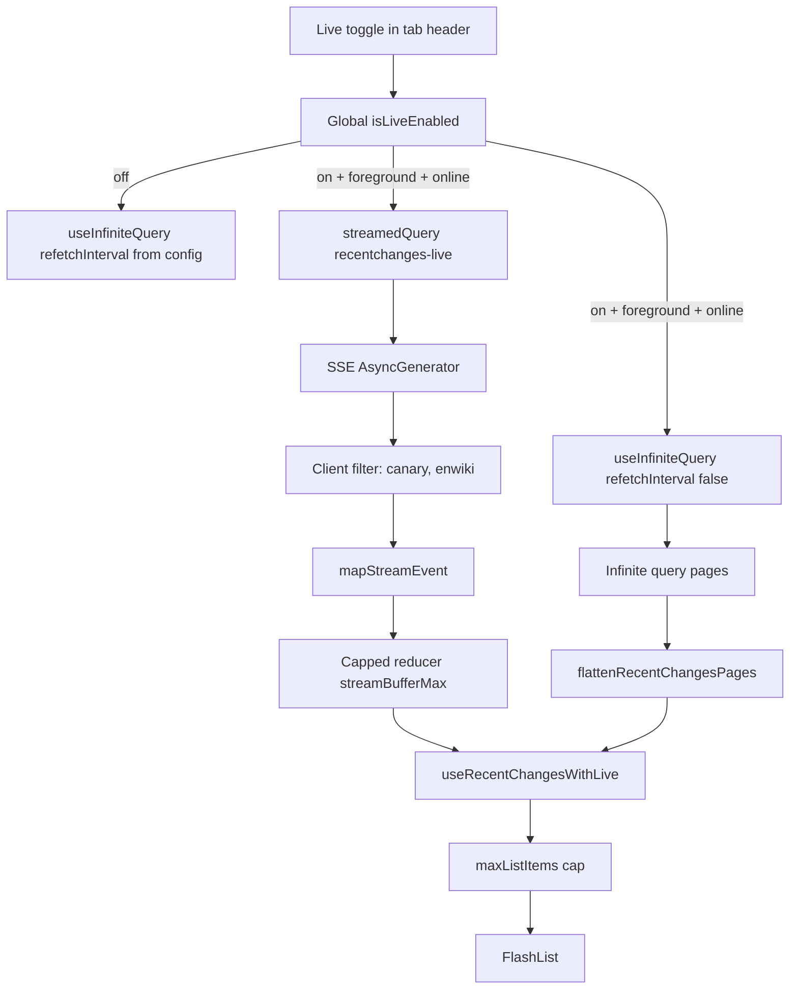

# WikiNow — SSE Live Mode

How  **Live mode** works in the mobile app. Read with [architecture.md](./architecture.md) (strategy) and [cache-behavior.md](./cache-behavior.md) (REST cache model).

**Status:** Implemented.

**Last updated:** 2026-06-26

---

## Goal

Mirror Wikimedia's [Recent Changes "Live updates"](https://www.mediawiki.org/wiki/Special:RecentChanges): **REST polling by default**, user-opt-in **SSE stream** for real-time head updates while foregrounded.

---

## Implementation summary

| Piece | Location |
|-------|----------|
| Live toggle UI | [`components/LiveToggle.tsx`](../mobile-app/components/LiveToggle.tsx) — tab header (`headerRight` on list tabs) |
| Global live state + stream query | [`providers/LiveModeProvider.tsx`](../mobile-app/providers/LiveModeProvider.tsx) |
| REST + stream merge | [`hooks/useRecentChangesWithLive.ts`](../mobile-app/hooks/useRecentChangesWithLive.ts) |
| SSE transport | [`api/recent-change-stream.ts`](../mobile-app/api/recent-change-stream.ts) |
| Stream → `RecentChange` | [`lib/live/map-stream-event.ts`](../mobile-app/lib/live/map-stream-event.ts) |
| Stream client filters | [`lib/live/filter-stream-event.ts`](../mobile-app/lib/live/filter-stream-event.ts) — canary + enwiki |
| Tab filter on merge | [`lib/recent-changes/matches-tab-filter.ts`](../mobile-app/lib/recent-changes/matches-tab-filter.ts) |
| List pin-to-top when live | [`components/ChangesList.tsx`](../mobile-app/components/ChangesList.tsx) |
| Debug logs | [`lib/live/log.ts`](../mobile-app/lib/live/log.ts) — gated by `liveLogEnabled` config |
| Stream buffer cap | `streamBufferMax` in [`constants/app-config.ts`](../mobile-app/constants/app-config.ts) |

**Query keys**
- REST: `['recentchanges', tab, filter, pageSize]`
- Live stream: `['recentchanges-live']` (global, not per tab)

---

## Architecture

TanStack [`experimental_streamedQuery`](https://tanstack.com/query/latest/docs/reference/streamedQuery) for SSE, alongside REST `useInfiniteQuery` for pagination.

### Two data paths

| Source | Delivers | Pagination |
|--------|----------|------------|
| REST `useInfiniteQuery` | Pages, server-filtered | `rccontinue` via `fetchNextPage` |
| `streamedQuery` on SSE | Single events, client-filtered | Prepend only via `mergeChanges` |

REST stays the backbone for initial load and downward pagination. The stream only buffers matching head events.

---

## SSE constraints

1. **Global firehose** — `{streamBaseUrl}/v2/stream/recentchange`; filter on device
2. **Discard canary:** `meta.domain === 'canary'`
3. **English Wikipedia:** `wiki === 'enwiki'`
4. **Tab filter at display:** `matchesTabFilter()` using same rules as [`TAB_FILTERS`](../mobile-app/constants/tabs.ts)
5. **Foreground + opted-in only** — stream closes on background, offline, toggle off
6. **Off by default**
7. **Live on → REST polling paused** (`refetchInterval: false`)

---

## Native SSE transport

React Native `fetch()` does **not** stream SSE responses (hangs until connection closes). The app uses:

| Platform | Transport |
|----------|-----------|
| Web | `fetch` + `ReadableStream` |
| iOS / Android | `XMLHttpRequest` + `onprogress` |

SSE lines parsed via [`lib/live/parse-sse-buffer.ts`](../mobile-app/lib/live/parse-sse-buffer.ts).

---

## Lifecycle

| Event | Action |
|-------|--------|
| Toggle ON | Open `streamedQuery`; REST `refetchInterval: false` |
| Toggle OFF | `cancelQueries` + `removeQueries` on live key; abort XHR |
| App background | Turn **off** live toggle; close stream; REST polling resumes |
| Offline | Stream closed; Live toggle disabled |
| Tab switch | Same global stream; per-tab filter on merge |

`isStreamConnected` uses `fetchStatus === 'fetching'` (not `isSuccess`) because never-ending SSE never completes the query function.

---

## Freshness

[`useRecentChangesWithLive`](../mobile-app/hooks/useRecentChangesWithLive.ts) merges API freshness with stream via `mergeFeedFreshness()` when live is on. Header shows `Live · updated Xm ago` when `source === 'stream'`.

---

## Acceptance criteria

- [x] Toggle off by default; REST-only behavior when off
- [x] Toggle on + foreground → matching enwiki events prepend without flicker
- [x] Header shows stream freshness when live events arrive
- [x] Live on → REST `refetchInterval` false; live off → polling resumes
- [x] Background / offline → stream closes; explicit cancel on toggle off
- [x] Stream buffer capped (`streamBufferMax`); list capped (`maxListItems`)
- [x] Canary events discarded

---

## Related docs

- [architecture.md](./architecture.md) — REST vs SSE strategy
- [cache-behavior.md](./cache-behavior.md) — REST pages + live query cache
- [plan.md](./plan.md) — project status
