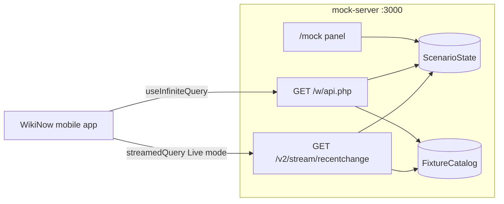

# Mock Server — Implementation Plan

**Status:** Implemented in `mock-server/`.

Live mode is done in the mobile app. The mock server **deterministically exercises** REST polling, SSE live mode, merge/dedupe, pagination, and failure UX without relying on production Wikimedia traffic.

---

## App contract (must match exactly)

The app hard-codes these paths and shapes — the mock is drop-in compatible via env vars only.

| Endpoint | Built by | Expected shape |
|----------|----------|----------------|
| REST | [`mobile-app/api/recent-changes.ts`](../mobile-app/api/recent-changes.ts) → `{apiBaseUrl}/w/api.php?...` | [`WikiRecentChangesResponse`](../mobile-app/types/wiki-recent-change.ts) |
| SSE | [`mobile-app/lib/live/transport/connect.ts`](../mobile-app/lib/live/transport/connect.ts) → `{streamBaseUrl}/v2/stream/recentchange` | [`StreamRecentChangeEvent`](../mobile-app/types/stream-recent-change.ts) in `data: {...}\n\n` lines |

**REST query params the app sends:**

- `action=query`, `format=json`, `formatversion=2`, `list=recentchanges`
- `rclimit` from app config (`pageSize`, default 10)
- `rcprop=title|user|timestamp|ids`
- Optional filters mirroring [`TAB_FILTERS`](../mobile-app/constants/tabs.ts): `rcnamespace=0`, `rctype=new`
- Cursor pagination via `rccontinue` (Wikimedia format: `timestamp|rcid`)

**SSE fields the app consumes** (from [`stream-events.ts`](../mobile-app/lib/live/stream-events.ts)):

- Accepts only `wiki === 'enwiki'` and rejects `meta.domain === 'canary'`
- Maps `id` → `rcid`, `timestamp` (unix seconds) → ISO string, `title_url` → `pageUrl`
- Tab filters applied client-side on merge (mock emits mixed namespaces/types to prove filtering)

**Env wiring** (no app code changes required):

```env
EXPO_PUBLIC_API_BASE_URL=http://localhost:3000
EXPO_PUBLIC_STREAM_BASE_URL=http://localhost:3000
```

Use LAN IP instead of `localhost` for physical devices; Android emulator typically needs `10.0.2.2:3000`.



---

## Stack

**Hono + Node** — single process, one port (default `3000`) serves REST, SSE, and the control panel.

| Package | Purpose |
|---------|---------|
| `hono` | HTTP router |
| `@hono/node-server` | Node adapter |
| `tsx` | Dev watch (`npm run dev`) |
| `typescript` | Types |

---

## Layout

```
mock-server/
  package.json
  tsconfig.json
  .env.example
  README.md
  src/
    index.ts
    types.ts
    fixtures/
      catalog.ts
      generator.ts
    lib/
      pagination.ts
      filters.ts
      scenarios.ts
      sse-format.ts
      sse-clients.ts
    routes/
      recent-changes.ts
      stream.ts
      mock-panel.ts
  __tests__/
    pagination.test.ts
    filters.test.ts
    sse-format.test.ts
```

---

## Scenario engine

Central mutable `ScenarioState` toggled by the `/mock` panel.

| Scenario | REST behavior | SSE behavior | Validates in app |
|----------|---------------|--------------|------------------|
| **Normal** (default) | Paginated catalog, filters applied | Idle until Live on; keepalive comments | Baseline |
| **1/sec steady** | Normal | Emit 1 enwiki event/sec while connected | Live prepend + stream freshness |
| **5/sec steady** | Normal | Emit 5 enwiki events/sec | High-rate header/list stress |
| **10/sec steady** | Normal | Emit 10 enwiki events/sec | Navigation update loop (fixed) |
| **20/sec steady** | Normal | Emit 20 enwiki events/sec | Peak load testing |
| **Burst** | Normal | Emit 10 events immediately on connect | `mergeChanges` batch at head |
| **500 error** | Next N REST requests → HTTP 500 | Unaffected | Error banner + TanStack retry |
| **Drop connection** | Normal | Close SSE socket after K events | Stream error / reconnect UX |
| **Duplicate / out-of-order** | Overlapping `rcid`s across cursor boundary | Emit ids `[105, 103, 105, 101]` | `mergeChanges` dedupe/sort |
| **Empty** | Always `recentchanges: []` | Can still stream or idle | Empty state UI |
| **Canary / non-enwiki** (bonus) | N/A | Mix canary and non-enwiki events | `isGlobalStreamEvent` filtering |

---

## Control panel

- `GET /mock` — HTML panel with scenario buttons
- `POST /mock/scenarios/:name` — activate scenario
- `GET /mock/status` — JSON status for debugging

---

## Manual integration checklist

1. Start mock: `cd mock-server && npm run dev`
2. Point app `.env` at mock; restart Expo
3. Verify REST list loads, infinite scroll, tab filters
4. Enable Live → steady stream prepends rows; header shows stream freshness
5. Trigger burst / duplicate / drop / 500 / empty from `/mock` and confirm app behavior

---

## Out of scope

- Full MediaWiki API parity
- Persistent state across server restarts
- Automated E2E against Expo
- Rich wiki HTML for WebView detail
